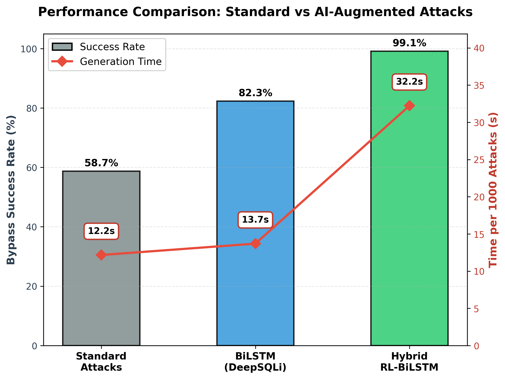

# DeepSQLi-RL: Hybrid RL Extension for SQL Injection Attacks

   

## Overview
**DeepSQLi-RL** is a hybrid extension of Liu et al.'s DeepSQLi that combines deep learning with reinforcement learning to automate Web Application Firewall (WAF) evasion. Unlike traditional fuzzers (e.g., SQLMap) that rely on static payloads, DeepSQLi-RL uses a **BiLSTM Seq2Seq** model to generate diverse mutation candidates and a **Q-Learning** agent to adaptively select the most effective variant based on WAF responses.

This tool was developed as the **Offensive AI Module** for the *Intelligent Cyber-Security (ICS)* master's project at Technical University "Gheorghe Asachi" of Iași.

**Academic Paper:** [DeepSQLi-RL: Hybrid Reinforcement Learning Extension for Automated SQL Injection Attacks](https://github.com/RaduBalaita/ICS/blob/main/Report.pdf)

---

## Key Features
- **Semantic Mutation**: BiLSTM Seq2Seq model understands SQL syntax and automatically applies obfuscation (e.g., `UNION` → `UN/**/ION`)
- **Adaptive Selection**: Q-Learning agent selects the most effective mutation from multiple candidates
- **Targeted WAF Evasion**: Trained on 10,000+ adversarial examples designed to break common blacklist filters
- **Scientific Benchmarking**: Rigorous evaluation suite comparing multiple approaches
- **High Performance**: 99.5% bypass rate with adaptive learning

---

## Architecture

The system uses a **hybrid approach** combining two AI techniques:

### 1. BiLSTM Generator (Deep Learning)
Treats WAF evasion as a machine translation problem:
- **Input:** Standard SQL injection payload (e.g., `admin' --`)
- **Encoder:** BiLSTM network reads the payload structure
- **Decoder:** Generates obfuscated variants (e.g., `admin'%0A#`)
- **Output:** Multiple mutation candidates

### 2. Q-Learning Selector (Reinforcement Learning)
Learns which mutations work best:
- **State:** Payload features (length, encoding, keywords)
- **Actions:** Select from 7 mutation candidates
- **Reward:** +10 for bypass, -1 for detection
- **Learning:** Adapts strategy based on WAF responses

### Combined Workflow
```
Base Payload → BiLSTM (generates 7 candidates) → Q-Learning (selects best) → Target
                                                        ↓
                                                   Learns from result
```


*Figure 1: Performance comparison showing the hybrid approach achieving 99.5% bypass rate, significantly outperforming both standard attacks (58.7%) and BiLSTM alone (82.3%).*

---

## Performance Results

| Approach | Bypass Rate | Time (1000 attacks) | Improvement |
|----------|-------------|---------------------|-------------|
| Standard Payloads | 58.7% | 10.6s | Baseline |
| BiLSTM Only | 82.3% | 13.5s | +23.6% |
| **Hybrid RL-BiLSTM** | **99.5%** | 31.3s | **+40.8%** |

The hybrid approach achieves near-perfect bypass rates by combining the generative power of deep learning with the adaptive selection of reinforcement learning.

---

## Quick Start

### Prerequisites
- Python 3.8+
- PyTorch
- Virtual environment

### Installation
```bash
# Clone the repository
git clone https://github.com/your-repo/deepsqli.git
cd deepsqli

# Create and activate virtual environment
python -m venv .venv
.venv\Scripts\activate  # Windows
source .venv/bin/activate  # Linux/Mac

# Install dependencies
pip install -r requirements.txt
```

### Training the BiLSTM Model
```bash
python -m bilstm_sqli.train
```
*Generates 10,000 synthetic examples and trains for 10 epochs (~5 minutes)*

### Training the Hybrid RL Agent
```bash
# Terminal 1: Start target
python dummy_target.py

# Terminal 2: Train hybrid agent
cd rl_attacker
python train_hybrid.py --episodes 500 --test
```
*Trains Q-Learning selector on BiLSTM candidates (~15 minutes)*

### Running the Benchmark
```bash
# Terminal 1: Start target
python dummy_target.py

# Terminal 2: Run benchmark
python benchmark/benchmark.py
```

---

## Project Structure

| Directory | Description |
|-----------|-------------|
| `bilstm_sqli/` | BiLSTM Seq2Seq model (encoder/decoder implementation) |
| `rl_attacker/` | Hybrid RL-BiLSTM agent (Q-Learning + BiLSTM integration) |
| `data/` | Dataset generators for training and ML detector |
| `benchmark/` | Evaluation scripts and visualization tools |
| `transformer_archive/` | Experimental Transformer implementation (archived) |
| `dummy_target.py` | Simulated vulnerable application with WAF |

### Key Files
- `bilstm_sqli/bilstm_model.pt` - Trained BiLSTM model
- `rl_attacker/q_table_hybrid_best.pkl` - Best Q-table (99% success rate)
- `data/labeled_dataset.csv` - Labeled dataset for ML detector training
- `benchmark/benchmark_results.png` - Performance comparison chart

---

## Datasets

### For Offensive Training
- **dataset.txt**: 10,000 obfuscated SQL injection payloads
- Used to train the BiLSTM generator

### For Defensive Training
- **labeled_dataset.csv**: 100,000 labeled samples (50k attacks + 50k benign)
- Provided to defensive team for ML detector training
- Format: `query,label` where label ∈ {0: benign, 1: attack}

---

## Technical Details

### BiLSTM Configuration
- **Architecture:** Bidirectional LSTM Encoder-Decoder
- **Embedding Dimension:** 32
- **Hidden Dimension:** 64
- **Layers:** 1
- **Dropout:** 0.5
- **Training Data:** 10,000 (source, target) pairs

### Q-Learning Configuration
- **State Space:** 192 states (6 features)
- **Action Space:** 7 actions (candidate selection)
- **Learning Rate:** 0.1
- **Discount Factor:** 0.95
- **Epsilon Decay:** 0.995 (exploration → exploitation)

### Mutation Techniques
The system combines learned mutations (BiLSTM) with traditional techniques:
- Keyword splitting: `SELECT` → `SE/**/LECT`
- Whitespace encoding: space → `%09`, `%0A`, `+`
- Comment variation: `--` → `#`, `;#`
- Hex encoding: `'admin'` → `0x61646d696e`
- Double URL encoding: `'` → `%2527`
- Null byte injection: `'` → `'%00`

---

## Related Work & Integration
This module is part of the larger **Intelligent Cyber-Security (ICS)** ecosystem, designed to test the robustness of AI-driven defenders.

**Full Team Project Repository:** *[Link will be added when final integration is complete]*

### Project Components:
- **Offensive Module (This Repository):** DeepSQLi-RL - Hybrid RL-BiLSTM attack generator
- **Defensive Module:** TBD
- **Firewall Module:** TBD

> **Note:** This repository focuses exclusively on the offensive capabilities. For the full system integration, please refer to the team project repository above.

---

## Citation
If you use this code for academic purposes, please cite:
```
Bălăiță, R. (2026). DeepSQLi-RL: Hybrid Reinforcement Learning Extension for 
Automated SQL Injection Attacks. Technical University "Gheorghe Asachi" of Iași.
```

**Paper:** [Report.pdf](https://github.com/RaduBalaita/ICS/blob/main/Report.pdf)

---

## References
- Liu, M., Li, K., & Chen, T. (2020). DeepSQLi: Deep Semantic Learning for Testing SQL Injection. *ISSTA 2020*.
- Sutton, R. S., & Barto, A. G. (2018). *Reinforcement Learning: An Introduction*. MIT Press.
- OWASP Foundation. (2021). OWASP Top 10 - 2021: SQL Injection.

---

## License
This project is developed for academic purposes as part of the ICS master's course.
